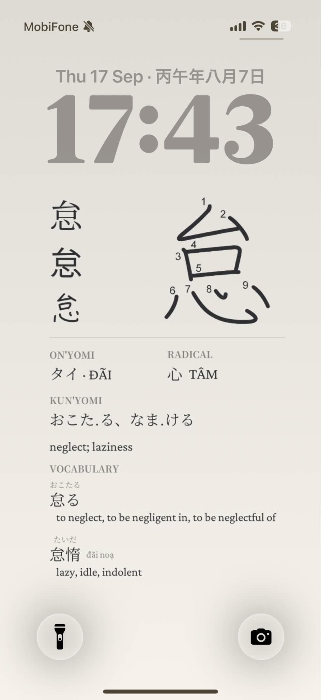
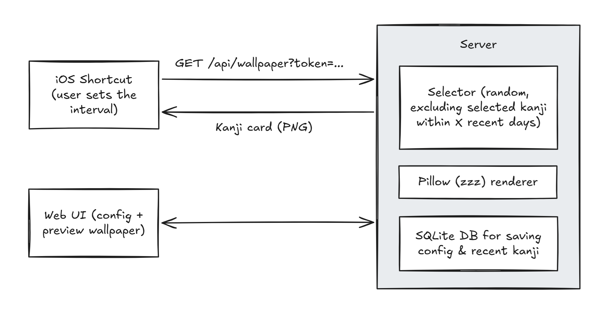

# kabekanji

A personal kanji study tool that generates lock screen wallpapers in an interval.
An iOS Shortcut fetches a new wallpaper each morning from the server and sets it automatically.



## Architecture



## Stack

- **Backend:** Python 3.11+, Flask, Pillow, SQLite
- **Frontend:** Vanilla HTML/CSS/JS (served as static files)
- **Data:**

  | Data source | Usage |
  | --- | --- |
  | [Hán Tự Thường Dùng Tiếng Nhật (Kanji JLPT N5 tới N1)](https://ankiweb.net/shared/info/2095212688) | Anki deck with 2136 Jouyou Kanji with readings (on, kun and Sino-Vietnamese), English meanings and stroke numbers |
  | [Bộ Thủ Chữ Hán (Tiếng Nhật)](https://ankiweb.net/shared/info/1364084349) | Anki deck with kanji radicals |
  | [Japanese Jouyou Kanji Word Readings](https://ankiweb.net/shared/info/351673913) | Anki deck with vocabulary examples for each jouyou kanji, ordered by frequency |

  The decks are programmatically cross-referenced and extracted into JSON files in the `data` directory using the `scripts/extract_data.py` script. The JSON files are then passed into `scripts/seed_db.py` to initialize the database for the app.

## Setup

### 1. Clone and install dependencies

```bash
cd kanji-wallpaper
python -m venv .venv
source .venv/bin/activate   # Windows: .venv\Scripts\activate
pip install -r requirements.txt
```

### 2. Download fonts

Place the `.ttf` files in `fonts/`:

- [Kanji Stroke Orders](https://www.nihilist.org.uk/): `fonts/KanjiStrokeOrders.ttf` — main character with stroke-order numbers baked in
- [Noto Sans JP](https://fonts.google.com/noto/specimen/Noto+Sans+JP): `fonts/NotoSansJP-Regular.ttf`, `fonts/NotoSansJP-Bold.ttf` — sans-serif/gothic style sample
- [Noto Serif JP](https://fonts.google.com/noto/specimen/Noto+Serif+JP): `fonts/NotoSerifJP-Regular.ttf` and `fonts/NotoSerifJP-Bold.ttf` — serif/mincho/kyokasho-ish style sample and UI
- [Y.OzFont Mouhitsu Gyosho](http://yozvox.web.fc2.com/YOzK97.7z): `fonts/YOzK97-Regular.ttf` — handwritten/gyosho calligraphy style sample
- [Crimson Pro](https://fonts.google.com/specimen/Crimson+Pro): `fonts/CrimsonPro-Regular.ttf` — serif for all non-Japanese text (English meanings, Sino-Vietnamese readings, Vietnamese diacritics) and UI font

### 3. Seed the database

This repo already includes pre-generated JSONs in `data/` that you can use to seed the DB directly.

```bash
python scripts/seed_db.py
```

This creates `data/kanji.db` from `data/kanji.json`.

### 4. (Optional) Regenerating the JSONs from source

The JSONs in `data/` were extracted from three Anki `.apkg` decks. If you ever need to regenerate them (updated deck, new vocab, etc.), place the source files in `data/` and run:

```bash
python scripts/extract_data.py
```

Source `.apkg` files needed are in the **Data** table above. Be sure to check that the file path constants in the script match the downloaded file names before running.

Once the JSONs are (re)generated, the `.apkg` files can be moved out of `data/`.

### 5. Run the server

For production / iOS Shortcut:

```bash
flask run --host 0.0.0.0 --port 8000
```

For local development (Python auto-reloads, but you have to manually refresh the browser to get latest static file changes):

```bash
python scripts/dev.py
```

Visit `http://localhost:8000` for the configuration UI.

### 6. Set up the iOS Shortcut

The web UI has a **Give me the shortcut!** button that opens an iCloud share link. On install, iOS asks the user for their token (shown in the web UI). The shortcut then fetches `/api/wallpaper?token=<their token>` and sets the result as the lock screen wallpaper.

To (re)publish the shortcut:

1. On an iPhone, build a shortcut with these actions:
   - **Text** named `Token`: placeholder content, e.g. `PASTE_TOKEN_HERE`
   - **Text** named `Server`: your deployed server URL, e.g. `https://kabekanji.example.com`
   - **Text** named `URL`: `[Server]/api/wallpaper?token=[Token]`
   - **Get Contents of URL**: input `[URL]`, method `GET`
   - **Set Wallpaper**: input `Contents of URL`, Show Preview off, Display Lock Screen, Both off
2. In the shortcut's **Details > Import Questions**, add a single question bound to the `Token` text action so iOS asks the user to paste their token on install.
3. **Share > Copy iCloud Link** and set the `https://www.icloud.com/shortcuts/...` URL as the `SHORTCUT_URL` env var (see [`.env.example`](./.env.example)). If it's empty, the install button is hidden.

Users then follow the flow inside the web UI:

1. Visit the site. The app generates a token for them and stores it in `localStorage`.
2. Tap **Give me the shortcut!** and paste the token when iOS prompts.
3. Optionally add an Automation (Shortcuts app > Automation > Time of Day > Daily > Run Immediately > Run Shortcut > kabekanji) to refresh the wallpaper on a schedule. You can mess around with the interval too.
4. To change the token later, either edit the `Token` text action inside the installed shortcut or re-import from the share link.

## Configuration

All configuration is managed through the web UI at the server root.
Settings are stored server-side, keyed by an 8-character token generated the first time the user visits the UI. The token is stored in `localStorage`, and returning users on a fresh browser can paste an existing token into the **Load token** input to recover their configuration.

| Setting | Description | Default |
| --- | --- | --- |
| Screen width | Wallpaper width in pixels | 1206 |
| Screen height | Wallpaper height in pixels | 2622 |
| Top margin | Pixels from top to avoid clock overlap | 400 |
| Bottom margin | Pixels from bottom to avoid controls | 300 |
| Recency window | Days before a kanji can repeat | 5 |
| Font styles | Which font variants to show | All enabled |
| Background color | Wallpaper background (hex) | `#121214` |
| Text color | Wallpaper text (hex) | `#F0F0F5` |

## Data files

### `kanji.json`

Keyed by the character, one entry per kanji. This file covers all 2136 jouyou kanji.

```json
"一": {
  "meanings":     ["one"],
  "on_yomi":      ["イチ", "イツ"],
  "kun_yomi":     ["ひと-", "ひと.つ"],
  "sinovi":       "NHẤT",
  "radical":      "一",
  "stroke_count": 1,
  "grade":        1,
  "jlpt":         5,
  "vocabulary": [
    { "word": "一つ", "reading": "ひとつ", "meaning": "one",
      "frequency": 552, "sinovi": "nhất" },
    ...
  ]
}
```

Coverage notes:

- `sinovi`, or Sino-Vietnamese pronunciation, is absent for the 6 kokuji (匂 峠 枠 栃 畑 込) with no Chinese origin and no Japanese-invented on'yomi.
- `vocabulary` holds up to 5 words per kanji ordered by frequency. The wallpaper only displays the top 3 due to lack of space.
- Per-word `sinovi` is added only for kanji-only words (space-separated primary readings, e.g. 丁寧 → "đinh ninh"). I had to hand-correct a lot of these to fit conventional Vietnamese readings, so I **do not recommend re-extracting the data from Anki decks**, as the corrected Sino-Vietnamese pronunciations will be lost.
    - For example, 大将 can be pronounced "đại *tương*" or "đại *tướng*" since 将 has two pronunciations, but obviously Vietnamese people only use the latter. Meanwile 将来 is "*tương* lai" and not "*tướng* lai". Languages man...

### `radicals.json`

This file maps the 214 Kangxi radical numbers to `{char, sinovi, english, ja_reading}`. It's loaded once by the wallpaper renderer at startup to look up the Sino-Vietnamese name of each kanji's radical.

## Future plans

Provided that I'm not too lazy...

- Give users a way to delete their configuration entries from the app (right now stale tokens accumulate on the server forever)
- Make the UI a bit more convenient on mobile
- If Android releases a native equivalent to Shortcuts, I might add it lol
- Maybe add a mode for plain vocab, or a mode for all those English words I looked up on my Kindle...
